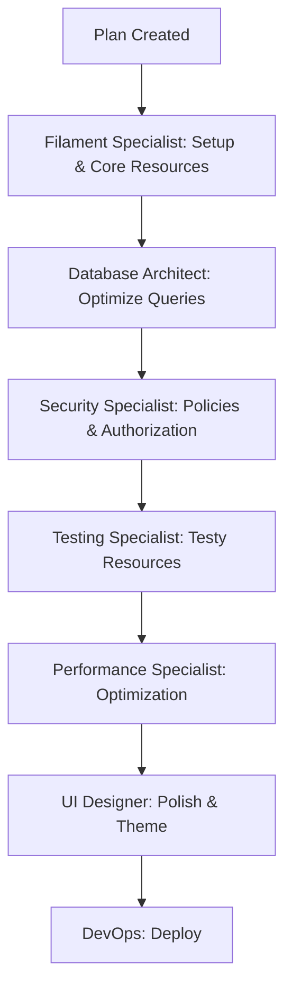

# Plan Systemu Administracji PetHelp - Filament 4

## Przegląd Systemu

System administracyjny PetHelp oparty na **Filament v4** zapewniający kompleksowe zarządzanie platformą dla opiekunów zwierząt.

### Technologie
- **Filament**: v4.x (Server-Driven UI)
- **Laravel**: v12
- **Livewire**: v3
- **Tailwind CSS**: v3

---

## 1. Architektura Panelu

### 1.1 Główne Moduły (Clusters)

#### 📊 **Dashboard Module**
- **Widgets**:
  - `StatsOverviewWidget` - Kluczowe metryki (użytkownicy, rezerwacje, przychody)
  - `RecentBookingsWidget` - Ostatnie rezerwacje
  - `RevenueChartWidget` - Wykres przychodów (7/30 dni)
  - `UserGrowthChartWidget` - Wzrost liczby użytkowników
  - `ActiveSittersMapWidget` - Mapa aktywnych opiekunów
  - `PendingActionsWidget` - Akcje wymagające uwagi

#### 👥 **User Management Cluster** (`app/Filament/Clusters/UserManagement`)
- **Resources**:
  - `UserResource` - Zarządzanie użytkownikami
    - Pages: List, Create, Edit, View
    - Relation Managers: Pets, Services, Bookings, Reviews, Subscriptions
    - Custom Actions: Grant Premium, Ban User, Send Email, Verify Account
    - Filters: Role, Premium Status, Registration Date, Verification Status

  - `UserProfileResource` - Profile użytkowników
    - Szczegółowe dane profili (bio, certyfikaty, doświadczenie)
    - Weryfikacja dokumentów
    - Historia zmian profilu

#### 🐾 **Pet & Service Cluster** (`app/Filament/Clusters/PetService`)
- **Resources**:
  - `PetResource` - Zarządzanie zwierzętami
    - Relation Managers: Owner (User), Bookings
    - Filters: Pet Type, Age, Special Needs

  - `ServiceResource` - Usługi opiekunów
    - Pages: List, Edit, View
    - Custom Actions: Activate/Deactivate, Feature Service
    - Filters: Service Category, Status, Price Range, Radius

  - `ServiceCategoryResource` - Kategorie usług
  - `PetTypeResource` - Typy zwierząt

#### 📅 **Booking & Payment Cluster** (`app/Filament/Clusters/BookingPayment`)
- **Resources**:
  - `BookingResource` - Zarządzanie rezerwacjami
    - Pages: List, View, Edit
    - Custom Actions: Cancel, Refund, Change Status, Contact Users
    - Relation Managers: Payments, Reviews
    - Filters: Status, Date Range, Service Type, User

  - `PaymentResource` - Płatności
    - Pages: List, View
    - Custom Actions: Issue Refund, Mark as Paid, Download Invoice
    - Filters: Status, Date Range, Amount Range, Payment Method

  - `AvailabilityResource` - Dostępność opiekunów
    - Calendar view
    - Bulk edit availability

#### 💼 **Subscription Management** (`app/Filament/Clusters/Subscriptions`)
- **Resources**:
  - `SubscriptionPlanResource` - Plany subskrypcji
    - CRUD planów (Basic, Pro, Premium)
    - Feature management
    - Pricing tiers

  - `SubscriptionResource` - Aktywne subskrypcje
    - Pages: List, View
    - Custom Actions: Cancel, Upgrade, Downgrade, Extend
    - Filters: Plan Type, Status, Expiry Date

#### 🛍️ **Marketplace Cluster** (`app/Filament/Clusters/Marketplace`)
- **Resources**:
  - `AdvertisementResource` - Ogłoszenia
    - Pages: List, Edit, View
    - Custom Actions: Approve, Reject, Feature, Report
    - Relation Managers: Images, Categories
    - Filters: Category, Status, User, Date

  - `EventResource` - Wydarzenia
    - Pages: List, Create, Edit, View
    - Relation Managers: Registrations, Location
    - Custom Actions: Publish, Cancel, Duplicate
    - Filters: Event Type, Status, Date, Organizer

#### 💬 **Communication Cluster** (`app/Filament/Clusters/Communication`)
- **Resources**:
  - `ConversationResource` - Rozmowy
    - View tylko (read-only)
    - Search by users, date
    - Custom Actions: Archive, Flag, Export

  - `MessageResource` - Wiadomości (monitoring)
    - Filters: Sender, Receiver, Date, Has Attachments
    - Custom Actions: Flag Inappropriate, Delete

  - `NotificationResource` - Powiadomienia
    - Bulk send notifications
    - Templates management

#### ⭐ **Review & Rating Cluster** (`app/Filament/Clusters/Reviews`)
- **Resources**:
  - `ReviewResource` - Opinie
    - Pages: List, View
    - Custom Actions: Approve, Flag, Remove, Reply
    - Filters: Rating, Status, Reviewer, Reviewee, Date
    - Bulk Actions: Approve Multiple, Remove Multiple

#### 📍 **Location & Map Cluster** (`app/Filament/Clusters/Location`)
- **Resources**:
  - `LocationResource` - Lokalizacje
  - `MapItemResource` - Punkty na mapie
  - `EventLocationResource` - Lokalizacje eventów

#### 🔧 **System Settings** (`app/Filament/Pages`)
- **Custom Pages**:
  - `GeneralSettings` - Ustawienia ogólne
  - `EmailSettings` - Konfiguracja email
  - `PaymentSettings` - Ustawienia płatności (PayU, Stripe)
  - `NotificationSettings` - Szablony powiadomień
  - `MaintenanceMode` - Tryb konserwacji

---

## 2. Resources - Szczegółowa Specyfikacja

### 2.1 UserResource

**Formularz (Tabs)**:
```php
- Tab: "Podstawowe dane"
  - name (TextInput, required)
  - email (TextInput, email, unique, required)
  - password (TextInput, password, dehydrated conditionally)
  - email_verified_at (DateTimePicker)
  - premium_until (DateTimePicker)

- Tab: "Profil"
  - profile.role (Select: owner, sitter, both, admin)
  - profile.first_name / last_name
  - profile.phone (TextInput, tel)
  - profile.bio (RichEditor)
  - profile.avatar (FileUpload, image)
  - profile.address (Repeater: street, city, postal_code)

- Tab: "Doświadczenie & Certyfikaty" (only for sitters)
  - profile.experience_years (TextInput, numeric)
  - profile.certifications (Repeater)
  - profile.has_insurance (Toggle)
  - profile.insurance_details (Textarea)
  - profile.pets_experience (CheckboxList)

- Tab: "Lokalizacja & Dostępność"
  - profile.latitude / longitude (TextInput, readonly)
  - profile.service_radius (TextInput, suffix: 'km')
  - profile.weekly_availability (KeyValue)
  - profile.emergency_available (Toggle)

- Tab: "Dom & Środowisko"
  - profile.home_type (Select)
  - profile.has_garden (Toggle)
  - profile.is_smoking (Toggle)
  - profile.has_other_pets (Toggle)
  - profile.other_pets (Repeater)
  - profile.home_photos (FileUpload, multiple, images)

- Tab: "Weryfikacja"
  - profile.is_verified (Toggle)
  - profile.verified_at (DateTimePicker)
  - profile.verification_status (Select)
  - profile.verification_documents (FileUpload, multiple)

- Tab: "Statystyki" (Placeholders - readonly)
  - created_at
  - total_bookings
  - rating_average
  - reviews_count
```

**Tabela (Columns)**:
```php
- ID (sortable, searchable)
- Avatar (ImageColumn, circular)
- Name (sortable, searchable, copyable)
- Email (sortable, searchable, copyable)
- Role (BadgeColumn with colors & icons)
- Premium Status (IconColumn, boolean)
- Verified (IconColumn, boolean)
- Created At (DateColumn, sortable)
- Bookings Count (counts relation)
- Rating (avg with stars icon)
```

**Filters**:
```php
- role (SelectFilter)
- premium (TernaryFilter)
- verified (TernaryFilter)
- created_at (DateRangeFilter)
- has_active_bookings (TernaryFilter)
```

**Actions**:
```php
// Row Actions
- ViewAction
- EditAction
- Action: Grant Premium (with date picker modal)
- Action: Revoke Premium (confirmation)
- Action: Verify Account (confirmation)
- Action: Ban User (with reason textarea, confirmation)
- Action: Send Email (with subject & message)

// Bulk Actions
- DeleteBulkAction (soft delete)
- BulkAction: Send Mass Email
- BulkAction: Grant Premium (with date picker)
- BulkAction: Export to CSV
```

**Relation Managers**:
```php
- PetsRelationManager
- ServicesRelationManager
- BookingsRelationManager (as owner & as sitter)
- ReviewsRelationManager (given & received)
- SubscriptionsRelationManager
- PaymentsRelationManager
```

### 2.2 BookingResource

**Formularz**:
```php
- Section: "Szczegóły rezerwacji"
  - owner_id (Select, relationship, searchable)
  - sitter_id (Select, relationship, searchable)
  - service_id (Select, relationship, dependent on sitter)
  - pet_id (Select, relationship, dependent on owner)
  - start_date (DateTimePicker, required)
  - end_date (DateTimePicker, required, after start_date)
  - status (Select: pending, confirmed, completed, cancelled)

- Section: "Ceny & Płatność"
  - total_price (TextInput, numeric, prefix: 'PLN')
  - payment_status (Select)
  - special_requirements (Textarea)
  - admin_notes (Textarea, visible only for admins)
```

**Tabela**:
```php
- ID (sortable, searchable)
- Owner (relationship, searchable)
- Sitter (relationship, searchable)
- Service (relationship)
- Pet (relationship)
- Start Date (DateTimeColumn, sortable)
- End Date (DateTimeColumn, sortable)
- Status (BadgeColumn, colors based on status)
- Total Price (TextColumn, money format)
- Payment Status (BadgeColumn)
```

**Filters**:
```php
- status (SelectFilter)
- payment_status (SelectFilter)
- start_date (DateRangeFilter)
- owner_id (SelectFilter, searchable)
- sitter_id (SelectFilter, searchable)
- service_type (SelectFilter via relationship)
```

**Actions**:
```php
// Row Actions
- ViewAction
- EditAction
- Action: Cancel Booking (with reason, refund toggle)
- Action: Complete Booking
- Action: Contact Owner (open message modal)
- Action: Contact Sitter (open message modal)
- Action: Issue Refund (with amount input)

// Bulk Actions
- BulkAction: Cancel Multiple (with reason)
- BulkAction: Export to CSV
- BulkAction: Send Reminder Email
```

### 2.3 PaymentResource

**Tabela (głównie read-only)**:
```php
- ID (sortable, searchable)
- User (relationship, searchable)
- Booking (relationship, nullable)
- Subscription (relationship, nullable)
- Amount (money format, sortable)
- Payment Method (BadgeColumn)
- Status (BadgeColumn: pending, completed, failed, refunded)
- Transaction ID (copyable)
- Created At (DateTimeColumn, sortable)
```

**Filters**:
```php
- status (SelectFilter)
- payment_method (SelectFilter)
- date (DateRangeFilter)
- amount (Filter with min/max inputs)
- type (SelectFilter: booking, subscription)
```

**Actions**:
```php
// Row Actions
- ViewAction
- Action: Issue Refund (with amount, reason)
- Action: Mark as Paid (admin override)
- Action: Download Invoice (PDF)
- Action: Resend Receipt Email

// Bulk Actions
- BulkAction: Export Transactions (CSV/Excel)
- BulkAction: Send Receipt Emails
```

---

## 3. Dashboard Widgets - Specyfikacja

### 3.1 StatsOverviewWidget

**Statystyki**:
```php
1. Total Users
   - Wartość: User::count()
   - Opis: "Nowych dzisiaj: X"
   - Kolor: success
   - Chart: 7-dniowy wykres rejestracji

2. Active Bookings
   - Wartość: Booking::where('status', 'active')->count()
   - Opis: "Oczekujących: X"
   - Kolor: warning

3. Today's Revenue
   - Wartość: Payment::whereDate('created_at', today())->sum('amount')
   - Opis: "Ten miesiąc: PLN X"
   - Kolor: success
   - Chart: 7-dniowy wykres przychodów

4. Pending Reviews
   - Wartość: Review::whereNull('approved_at')->count()
   - Opis: "Do moderacji"
   - Kolor: danger

5. Active Subscriptions
   - Wartość: Subscription::active()->count()
   - Opis: "Wygasających w tym miesiącu: X"
   - Kolor: info
```

### 3.2 RecentBookingsWidget (Table Widget)

**Kolumny**:
```php
- Owner (with avatar)
- Sitter (with avatar)
- Service Type
- Dates
- Status Badge
- Amount
- Quick Actions (View, Edit, Cancel)
```

**Query**: Ostatnie 10 rezerwacji

### 3.3 RevenueChartWidget (Chart Widget)

**Typy wykresów**:
- Line chart: Przychody w czasie (7/30/90 dni)
- Filters: Period, Payment Method

### 3.4 ActiveSittersMapWidget (Custom Widget)

**Funkcjonalność**:
- Mapa z markerami aktywnych opiekunów
- Clustering dla dużej liczby markerów
- Click na marker → info popup
- Filter: Service Type, Verified Only

---

## 4. Authorization & Policies

### 4.1 Policies do utworzenia

```php
app/Policies/
├── UserPolicy.php
├── BookingPolicy.php
├── PaymentPolicy.php
├── ServicePolicy.php
├── AdvertisementPolicy.php
├── EventPolicy.php
├── ReviewPolicy.php
├── SubscriptionPolicy.php
└── NotificationPolicy.php
```

### 4.2 Permissions Matrix

| Resource | View Any | View | Create | Update | Delete | Restore | Force Delete |
|----------|----------|------|--------|--------|--------|---------|--------------|
| User | Admin | Admin, Self | Admin | Admin, Self (limited) | Admin | Admin | Admin |
| Booking | Admin, Involved Users | Admin, Involved | Owner, Sitter | Admin, Owner (before start) | Admin | Admin | Admin |
| Payment | Admin | Admin, Owner | System | Admin (limited) | Never | - | - |
| Service | All | All | Sitter | Sitter (own), Admin | Sitter (own), Admin | Admin | Admin |
| Advertisement | All | All | User | Owner, Admin | Owner, Admin | Admin | Admin |
| Review | All | All | User | Admin | Admin | Admin | Admin |

### 4.3 Gate Definitions

```php
// app/Providers/AuthServiceProvider.php
Gate::define('access-admin-panel', fn(User $user) => $user->isAdmin());
Gate::define('view-analytics', fn(User $user) => $user->isAdmin());
Gate::define('manage-subscriptions', fn(User $user) => $user->isAdmin());
Gate::define('moderate-content', fn(User $user) => $user->isAdmin());
Gate::define('issue-refunds', fn(User $user) => $user->isAdmin());
```

---

## 5. Custom Actions & Bulk Actions

### 5.1 Frequently Used Custom Actions

#### UserResource Actions:
```php
Action::make('grant_premium')
    ->label('Przyznaj Premium')
    ->icon('heroicon-o-star')
    ->form([
        DateTimePicker::make('premium_until')
            ->label('Premium do')
            ->required()
            ->minDate(now())
    ])
    ->action(fn(User $record, array $data) =>
        $record->update(['premium_until' => $data['premium_until']])
    )
    ->visible(fn(User $record) => !$record->isPremium())
    ->requiresConfirmation()
    ->successNotification('Premium zostało przyznane!')
```

#### BookingResource Actions:
```php
Action::make('cancel_booking')
    ->label('Anuluj rezerwację')
    ->icon('heroicon-o-x-circle')
    ->color('danger')
    ->form([
        Textarea::make('cancellation_reason')
            ->label('Powód anulowania')
            ->required(),
        Toggle::make('refund')
            ->label('Zwróć płatność')
            ->default(true)
    ])
    ->action(function(Booking $record, array $data) {
        $record->cancel($data['cancellation_reason']);
        if ($data['refund']) {
            $record->payment?->refund();
        }
    })
    ->after(fn() => Notification::make()
        ->success()
        ->title('Rezerwacja anulowana')
        ->send()
    )
```

### 5.2 Bulk Actions

```php
// UserResource
BulkAction::make('send_email')
    ->label('Wyślij email do zaznaczonych')
    ->icon('heroicon-o-envelope')
    ->form([
        TextInput::make('subject')->required(),
        RichEditor::make('message')->required()
    ])
    ->action(function(Collection $records, array $data) {
        foreach($records as $user) {
            Mail::to($user->email)->send(new AdminNotification($data));
        }
    })
    ->deselectRecordsAfterCompletion()
    ->successNotification('Wiadomości wysłane!')

// BookingResource
BulkAction::make('export_bookings')
    ->label('Eksportuj do CSV')
    ->action(fn(Collection $records) =>
        Excel::download(new BookingsExport($records), 'bookings.csv')
    )
```

---

## 6. Performance Optimization

### 6.1 Eager Loading Strategy

```php
// W każdym Resource
protected static function getEloquentQuery(): Builder
{
    return parent::getEloquentQuery()
        ->with([
            // Załaduj tylko potrzebne relacje
            'profile:id,user_id,role,avatar,rating_average',
            'activeSubscription:id,user_id,status',
        ]);
}
```

### 6.2 Caching Strategy

```php
// Dla Widgets
protected static ?string $pollingInterval = '30s'; // Auto-refresh

// Cache expensive queries
protected function getStats(): array
{
    return Cache::remember('admin.stats.overview', 300, function() {
        return [
            'users' => User::count(),
            'revenue' => Payment::completed()->sum('amount'),
            // ...
        ];
    });
}
```

### 6.3 Database Indexes

```sql
-- Dodaj indeksy dla często filtrowanych kolumn
CREATE INDEX idx_users_premium ON users(premium_until);
CREATE INDEX idx_bookings_status ON bookings(status);
CREATE INDEX idx_bookings_dates ON bookings(start_date, end_date);
CREATE INDEX idx_payments_status ON payments(status);
CREATE INDEX idx_reviews_approved ON reviews(approved_at);
```

---

## 7. Testing Strategy

### 7.1 Resource Tests

```php
tests/Feature/Filament/Resources/
├── UserResourceTest.php
├── BookingResourceTest.php
├── PaymentResourceTest.php
├── ServiceResourceTest.php
└── ...

// Przykładowy test
test('admin can create user through resource', function() {
    $this->actingAs(User::factory()->admin()->create());

    Livewire::test(UserResource\Pages\CreateUser::class)
        ->fillForm([
            'name' => 'Jan Kowalski',
            'email' => 'jan@example.com',
            'password' => 'password123',
        ])
        ->call('create')
        ->assertHasNoErrors();

    $this->assertDatabaseHas('users', [
        'email' => 'jan@example.com'
    ]);
});
```

### 7.2 Widget Tests

```php
test('stats widget displays correct counts', function() {
    User::factory()->count(10)->create();

    Livewire::test(StatsOverviewWidget::class)
        ->assertSeeHtml('11'); // 10 + test admin
});
```

### 7.3 Policy Tests

```php
test('admin can view any users', function() {
    $admin = User::factory()->admin()->create();
    $policy = new UserPolicy();

    expect($policy->viewAny($admin))->toBeTrue();
});

test('regular user cannot delete other users', function() {
    $user = User::factory()->create();
    $other = User::factory()->create();
    $policy = new UserPolicy();

    expect($policy->delete($user, $other))->toBeFalse();
});
```

---

## 8. Timeline Implementacji

### Faza 1: Fundament (Dni 1-2)
- ✅ Instalacja Filament 4
- ✅ Konfiguracja panelu admin
- ✅ Utworzenie pierwszego użytkownika admin
- ✅ Podstawowa struktura katalogów

### Faza 2: Core Resources (Dni 3-5)
- ✅ UserResource (kompletny z Relation Managers)
- ✅ UserProfileResource
- ✅ Podstawowe Policies (User, UserProfile)

### Faza 3: Booking & Payment (Dni 6-8)
- ✅ BookingResource
- ✅ PaymentResource
- ✅ AvailabilityResource
- ✅ Custom Actions (Cancel, Refund)
- ✅ Policies

### Faza 4: Pets & Services (Dni 9-11)
- ✅ PetResource
- ✅ ServiceResource
- ✅ ServiceCategoryResource
- ✅ Relation Managers
- ✅ Policies

### Faza 5: Marketplace & Communication (Dni 12-14)
- ✅ AdvertisementResource
- ✅ EventResource
- ✅ ConversationResource (read-only)
- ✅ NotificationResource
- ✅ Policies

### Faza 6: Dashboard & Analytics (Dni 15-17)
- ✅ StatsOverviewWidget
- ✅ RevenueChartWidget
- ✅ RecentBookingsWidget
- ✅ ActiveSittersMapWidget
- ✅ Dashboard layout

### Faza 7: Advanced Features (Dni 18-20)
- ✅ Subscription Management Resources
- ✅ Review Moderation
- ✅ Custom Settings Pages
- ✅ Bulk Actions
- ✅ Export functionality

### Faza 8: Testing & Polish (Dni 21-25)
- ✅ Testy Resources (100% coverage)
- ✅ Testy Policies
- ✅ Testy Widgets
- ✅ Performance optimization
- ✅ Security audit

### Faza 9: Documentation & Training (Dni 26-30)
- ✅ Dokumentacja użytkownika (screenshots, guides)
- ✅ Dokumentacja techniczna
- ✅ Admin user training materials
- ✅ Deployment & maintenance guide

---

## 9. Bezpieczeństwo

### 9.1 Checklist Bezpieczeństwa

- [ ] Każdy Resource ma Policy
- [ ] Wszystkie formularze mają walidację
- [ ] Wrażliwe dane są maskowane (hasła, tokeny)
- [ ] Soft deletes dla user data (GDPR)
- [ ] Audit trail dla admin actions
- [ ] 2FA dla kont admin (opcjonalne)
- [ ] Rate limiting dla admin panel
- [ ] CSRF protection włączone
- [ ] XSS protection w RichEditor fields
- [ ] File upload validation (types, sizes)

### 9.2 Audit Trail Implementation

```php
// app/Models/AdminAudit.php
Schema::create('admin_audits', function(Blueprint $table) {
    $table->id();
    $table->foreignId('admin_id')->constrained('users');
    $table->string('action'); // create, update, delete
    $table->string('resource'); // UserResource, BookingResource
    $table->unsignedBigInteger('resource_id')->nullable();
    $table->json('old_values')->nullable();
    $table->json('new_values')->nullable();
    $table->ipAddress('ip_address');
    $table->text('user_agent');
    $table->timestamps();
});
```

---

## 10. Narzędzia & Integracje

### 10.1 Wymagane Pakiety

```json
{
    "require": {
        "filament/filament": "^4.0",
        "filament/spatie-laravel-tags-plugin": "^4.0",
        "filament/spatie-laravel-media-library-plugin": "^4.0",
        "pxlrbt/filament-excel": "^2.0",
        "joaopaulolndev/filament-pdf-viewer": "^1.0"
    }
}
```

### 10.2 Polecane Pluginy

- **filament-excel**: Export do Excel/CSV
- **filament-pdf-viewer**: Podgląd PDF dokumentów weryfikacyjnych
- **filament-spatie-tags**: Tagowanie resources
- **filament-media-library**: Zarządzanie zdjęciami

---

## 11. Wykorzystanie Agentów

### 11.1 Agent Assignment Matrix

| Agent | Odpowiedzialność | Narzędzia |
|-------|-----------------|-----------|
| **Filament Specialist** | Resources, Widgets, Dashboard, Forms, Tables | `search-docs`, `make:filament-*` |
| **Database Architect** | Migrations, Query optimization, Indexes | `search-docs`, migrations |
| **Security Specialist** | Policies, Authorization, Audit Trail | Gates, Policies, Security audit |
| **Testing Specialist** | Testy Resources, Widgets, Policies | Pest, Livewire testing |
| **Performance Specialist** | Caching, Query optimization, Eager loading | Performance profiling |
| **UI Designer** | Theme customization, Custom components | Tailwind, Blade |
| **DevOps Specialist** | Deployment, Environment setup | Docker, Sail |

### 11.2 Agent Workflow



---

## 12. Maintenance & Updates

### 12.1 Monitoring

- **Laravel Debugbar**: Development monitoring
- **Laravel Telescope**: Query monitoring, exceptions
- **Log Monitor**: `node log-monitor.cjs` dla live logs
- **Performance**: N+1 query detection

### 12.2 Update Strategy

```bash
# Aktualizacja Filament
composer update filament/filament

# Publikacja zmian w assets
php artisan filament:upgrade

# Clear cache
php artisan filament:clear-cached-components
php artisan optimize:clear
```

---

## 13. Next Steps - Plan Wykonania

### Krok 1: Instalacja (z Filament Specialist)
```bash
composer require filament/filament:"^4.0" --no-interaction
php artisan filament:install --panels --no-interaction
php artisan make:filament-user
```

### Krok 2: Struktura Katalogów
```
app/Filament/
├── Clusters/
│   ├── UserManagement/
│   ├── PetService/
│   ├── BookingPayment/
│   ├── Subscriptions/
│   ├── Marketplace/
│   ├── Communication/
│   ├── Reviews/
│   └── Location/
├── Pages/
│   ├── Dashboard.php
│   └── Settings/
├── Resources/
├── Widgets/
└── Policies/
```

### Krok 3: Pierwszy Resource (UserResource)
- Użyj `php artisan make:filament-resource User --generate --view`
- Dodaj Relation Managers
- Stwórz Custom Actions
- Napisz Policy
- Testy

### Krok 4: Iterate przez pozostałe Resources
- Booking → Payment → Service → Pet
- Advertisement → Event → Review
- Subscription → Notification

### Krok 5: Dashboard & Analytics
- Stats Widgets
- Chart Widgets
- Custom Widgets
- Dashboard Layout

### Krok 6: Testing & Polish
- 100% test coverage
- Performance audit
- Security audit
- Documentation

---

## 14. Success Metrics

### KPIs
- ✅ **Page Load Time**: < 500ms dla list resources
- ✅ **Query Count**: < 10 queries per request
- ✅ **Admin Onboarding**: < 30 minut
- ✅ **Test Coverage**: > 90%
- ✅ **Error Rate**: < 1%
- ✅ **User Satisfaction**: > 4.5/5

---

## Podsumowanie

System administracyjny PetHelp oparty na **Filament 4** zapewni:

✅ **Kompleksowe zarządzanie** wszystkimi aspektami platformy
✅ **Intuicyjny interfejs** z minimalnym training time
✅ **Wysoką wydajność** dzięki optymalizacji i cachingowi
✅ **Bezpieczeństwo** na poziomie enterprise
✅ **Skalowalność** dla rosnącej liczby użytkowników
✅ **Łatwość utrzymania** dzięki standardom Filament

**Czas realizacji**: 25-30 dni roboczych
**Wymagane zasoby**: Zespół specjalistycznych agentów + 1 developer (koordynacja)
