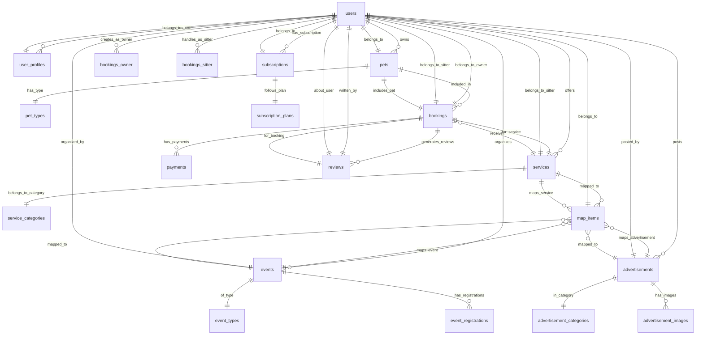
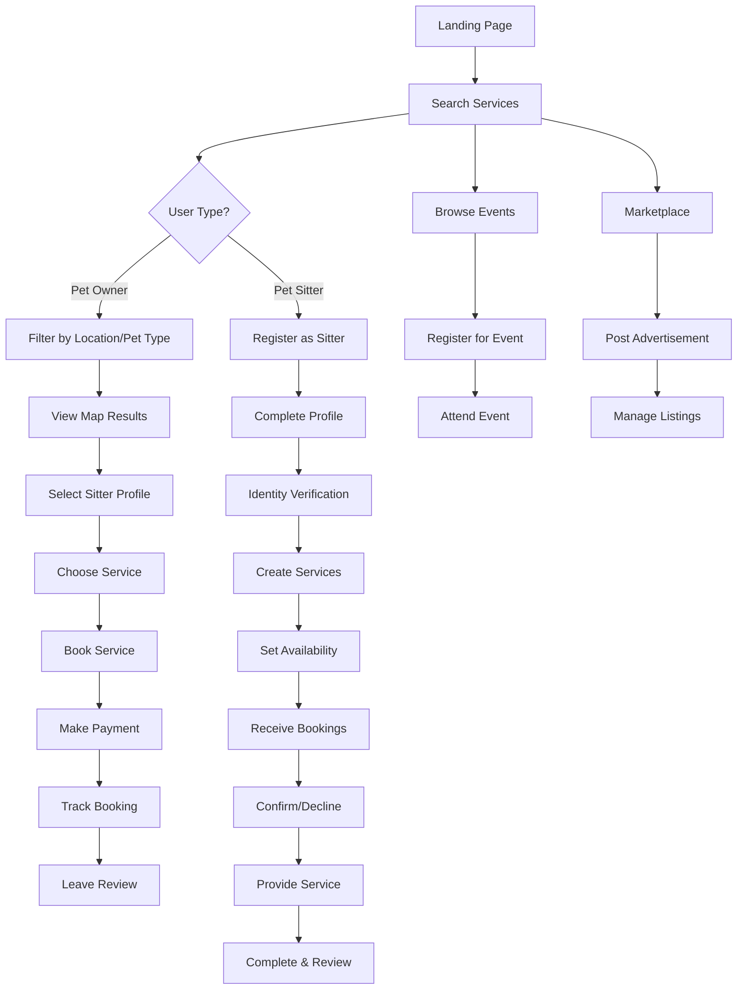
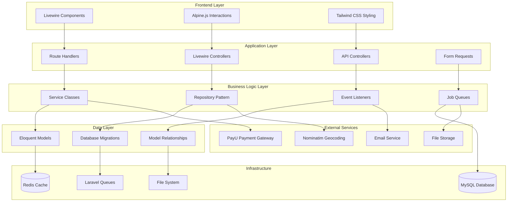
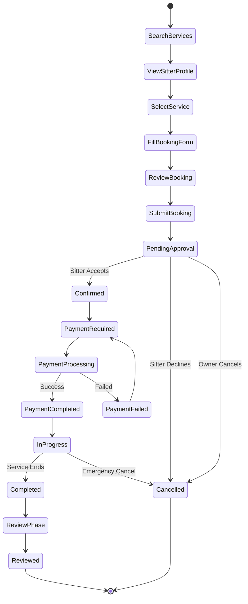
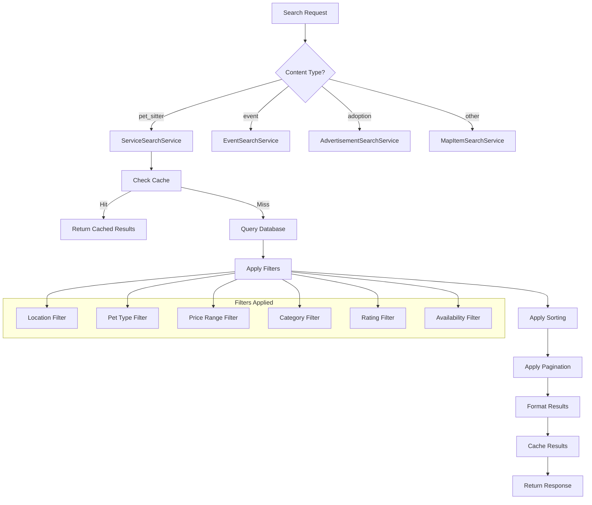
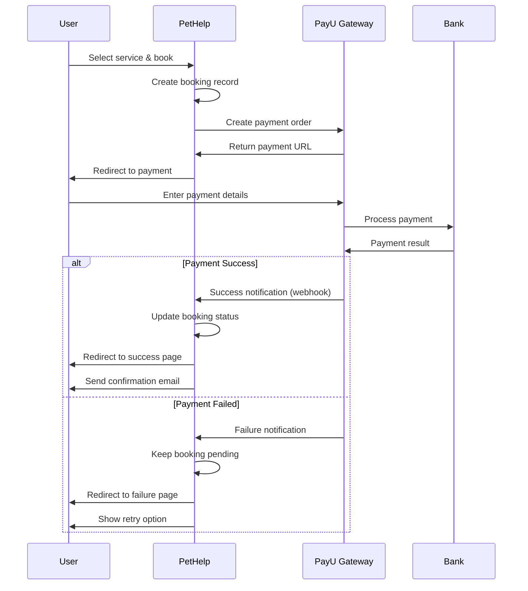
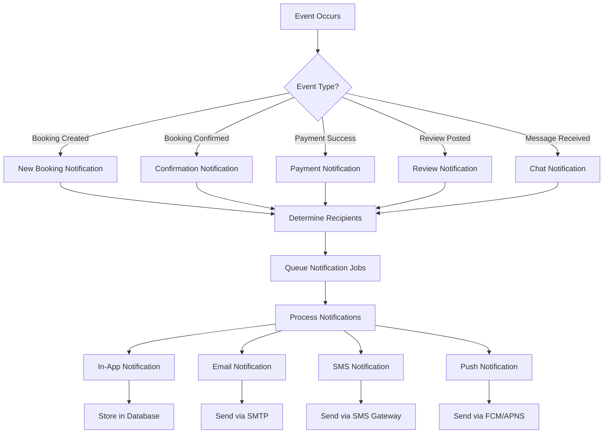
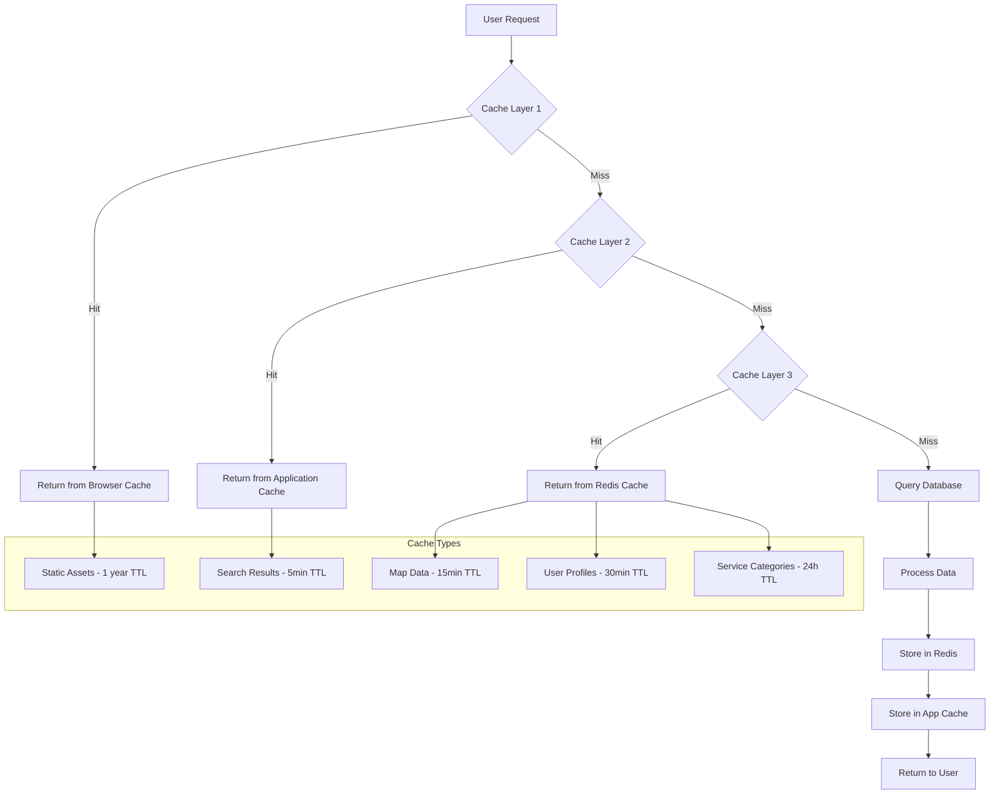
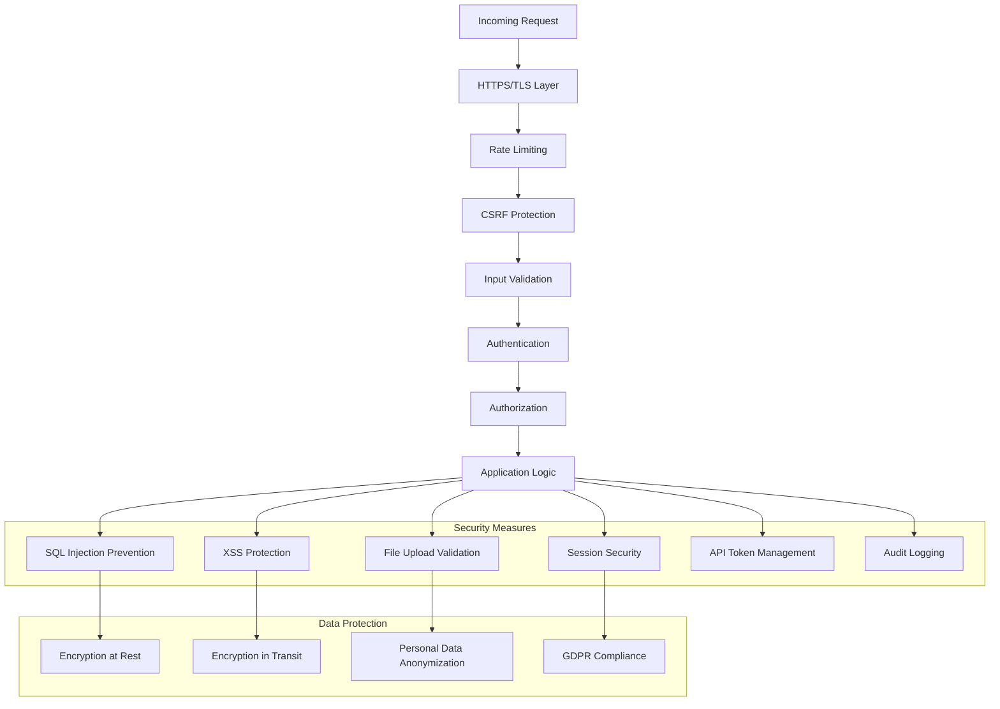

# 🗺️ DIAGRAMY SYSTEMU PETHELP (Mermaid)

## 1. ENTITY RELATIONSHIP DIAGRAM



## 2. USER JOURNEY FLOWCHART



## 3. SYSTEM ARCHITECTURE DIAGRAM



## 4. BOOKING PROCESS FLOW



## 5. API ARCHITECTURE DIAGRAM

```mermaid
graph LR
    subgraph "Client Applications"
        A[Web Browser]
        B[Mobile App]
        C[Third Party Apps]
    end

    subgraph "API Gateway"
        D[Rate Limiting]
        E[Authentication]
        F[Request Validation]
    end

    subgraph "API Endpoints"
        G[/api/search]
        H[/api/locations]
        I[/api/bookings]
        J[/api/payments]
        K[/api/js-logs]
    end

    subgraph "Service Layer"
        L[SearchService]
        M[LocationService]
        N[BookingService]
        O[PaymentService]
        P[LoggingService]
    end

    subgraph "Data Sources"
        Q[(Database)]
        R[(Cache)]
        S[External APIs]
    end

    A --> D
    B --> E
    C --> F
    D --> G
    E --> H
    F --> I
    G --> L
    H --> M
    I --> N
    J --> O
    K --> P
    L --> Q
    M --> R
    N --> S
```

## 6. SEARCH SYSTEM FLOW



## 7. PAYMENT PROCESS FLOW



## 8. REAL-TIME NOTIFICATIONS FLOW



## 9. CACHING STRATEGY DIAGRAM



## 10. SECURITY LAYERS DIAGRAM



---

## Jak Używać Tych Diagramów:

### 1. **GitHub/GitLab Integration**
Diagramy Mermaid są automatycznie renderowane w README.md i innych plikach Markdown na platformach Git.

### 2. **VS Code Extensions**
- Mermaid Preview
- Mermaid Markdown Syntax Highlighting

### 3. **Online Tools**
- https://mermaid.live/ - live editor
- https://mermaidjs.github.io/ - dokumentacja

### 4. **Export Options**
Diagramy można eksportować jako:
- SVG (skalowalne)
- PNG (statyczne)
- PDF (dokumentacja)

### 5. **Documentation Integration**
Idealne do:
- Dokumentacji projektowej
- Prezentacji dla stakeholderów
- Onboarding nowych developerów
- System design reviews