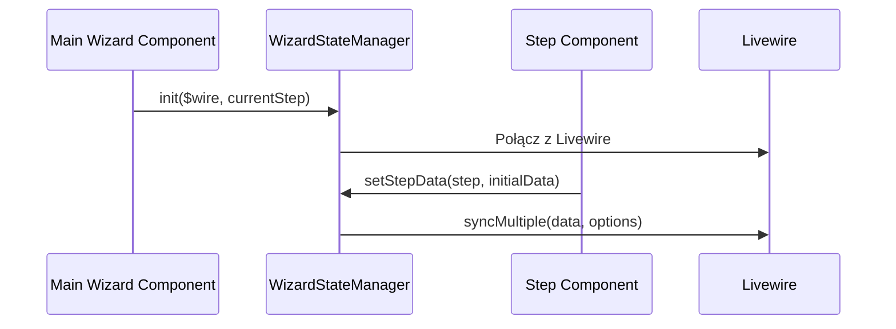
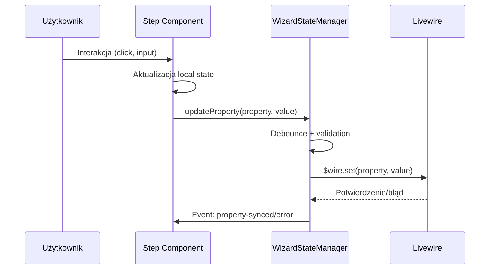
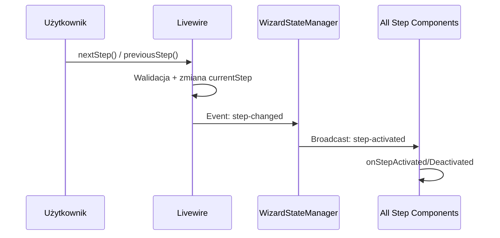

# Architektura Wizarda Pet-Sitter v2.0.0

## 📋 Przegląd

Nowa architektura wizarda Pet-Sitter wykorzystuje **centralne zarządzanie stanem** do eliminacji problemów międzykrokowych i zapewnia spójną synchronizację między Alpine.js a Livewire. Wszystkie kroki używają teraz zunifikowanej struktury komponentów.

## 🏗️ Główne Komponenty

### 1. WizardStateManager (Globalny Menedżer Stanu)

**Plik:** `resources/js/wizard-state-manager.js`

Centralny singleton zarządzający całym stanem wizarda:

```javascript
window.WizardStateManager = {
    // Stan globalny
    currentStep: 1,
    stepsData: new Map(),
    syncStatus: { isConnected, lastSync, pendingSyncs, errors },
    $wire: null,

    // Główne metody
    init($wire, initialStep),           // Inicjalizacja
    syncProperty(property, value, options), // Synchronizacja z Livewire
    syncMultiple(data, options),        // Batch sync
    broadcastEvent(eventName, data),    // Event broadcasting
    handleStepChange(stepData),         // Zmiana kroków
    debug()                            // Debugging
}
```

**Kluczowe funkcje:**
- ✅ **Centralna synchronizacja** z Livewire przez debounced updates
- ✅ **Event-driven komunikacja** między komponentami
- ✅ **Error handling** z retry logic
- ✅ **Cache danych** wszystkich kroków
- ✅ **Performance optimization** przez batching

### 2. Fabryka Komponentów Kroków

**Funkcja:** `window.createWizardStepComponent(stepNumber, initialData)`

Uniwersalna fabryka tworząca spójne komponenty dla wszystkich kroków:

```javascript
const component = createWizardStepComponent(7, {
    homeType: 'apartment',
    hasGarden: false,
    // ... inne dane
});
```

**Zapewnia:**
- 🔄 **Spójny lifecycle** (init, onStepActivated, onStepDeactivated)
- 🔗 **Automatyczną synchronizację** z WizardStateManager
- 📡 **Event listeners** dla zmian kroków
- ⚡ **Performance optimizations**

### 3. Komponenty Kroków

Każdy krok dziedziczy z fabryki i rozszerza funkcjonalność:

#### Krok 6 - Dostępność
```javascript
function wizardStep6() {
    const baseComponent = createWizardStepComponent(6, initialData);

    return {
        ...baseComponent,  // Dziedziczenie

        // Specyficzne dane
        weeklyAvailability: {...},
        flexibleSchedule: boolean,

        // Specyficzne metody
        toggleDay(day),
        updateTime(day, field, value),
        validateDayTimes(day)
    };
}
```

#### Krok 7 - Dom i ogród
```javascript
function wizardStep7() {
    const baseComponent = createWizardStepComponent(7, initialData);

    return {
        ...baseComponent,

        // Specyficzne dane
        homeType: string,
        hasGarden: boolean,
        otherPets: array,

        // Specyficzne metody
        selectHomeType(type),
        toggleGarden(),
        togglePet(petType)
    };
}
```

## 🔄 Przepływ Danych

### 1. Inicjalizacja


### 2. Aktualizacja Danych


### 3. Zmiana Kroków


## 🎨 Nowe Style CSS

### Unified Checkbox Tiles
```css
.wizard-checkbox-tile {
    /* Natychmiastowy feedback bez czekania na Livewire */
    @apply flex items-center p-4 border rounded-xl cursor-pointer;
    @apply transition-all duration-200 ease-out;
    @apply border-gray-300 hover:bg-gray-50;
}

.wizard-checkbox-tile.selected {
    /* Stan zaznaczony - różne kolory dla różnych kroków */
    @apply border-emerald-500 bg-emerald-50;
    transform: scale(1.02);
}

.wizard-checkbox-tile.small {
    /* Dla małych tiles (inne zwierzęta) */
    @apply p-3 relative;
    min-height: 80px;
}
```

### Responsive Class Bindings
```blade
{{-- Stary sposób (problematyczny) --}}
:class="homeType === 'apartment' ? 'selected' : ''"

{{-- Nowy sposób (reaktywny) --}}
:class="{ 'selected': homeType === 'apartment' }"
```

## ⚡ Optymalizacje Performance

### 1. Debounced Synchronizacja
```javascript
// Automatyczny debounce dla częstych aktualizacji
syncProperty('weeklyAvailability', data, { debounce: 300 });

// Natychmiastowa synchronizacja dla krytycznych danych
syncProperty('homeType', value, { immediate: true });
```

### 2. Batch Updates
```javascript
// Zamiast wielu pojedynczych wywołań
WizardStateManager.syncMultiple({
    homeType: this.homeType,
    hasGarden: this.hasGarden,
    hasOtherPets: this.hasOtherPets
}, { debounce: 0 });
```

### 3. Smart Caching
```javascript
// Cache danych kroków eliminuje niepotrzebne re-fetche
stepsData: new Map(),  // Key: stepNumber, Value: stepData
```

## 🐛 System Obsługi Błędów

### 1. Retry Logic
```javascript
async performSync(property, value, syncId, retry = true) {
    try {
        await this.$wire.set(property, value, false);
    } catch (error) {
        if (retry && this.syncStatus.errors.length < 3) {
            // Automatyczny retry po 1 sekundzie
            setTimeout(() => this.performSync(property, value, syncId, false), 1000);
        }
    }
}
```

### 2. Error Tracking
```javascript
syncStatus: {
    isConnected: false,
    lastSync: null,
    pendingSyncs: new Set(),
    errors: []  // Historia błędów z timestampami
}
```

### 3. Graceful Degradation
```javascript
// Fallback gdy WizardStateManager niedostępny
const baseComponent = window.createWizardStepComponent ?
    window.createWizardStepComponent(7, initialData) : {};
```

## 📱 Responsywność i Dostępność

### Mobile-First Design
- **Touch-friendly** checkbox tiles z min-height 60px
- **Large touch targets** dla wszystkich interakcji
- **Smooth animations** z redukcją ruchu dla użytkowników z ograniczeniami

### High Contrast Support
```css
@media (prefers-contrast: high) {
    .wizard-checkbox-tile {
        @apply border-2 border-gray-900;
    }
    .wizard-checkbox-tile.selected {
        @apply border-emerald-700 bg-emerald-200;
    }
}
```

### Reduced Motion Support
```css
@media (prefers-reduced-motion: reduce) {
    .wizard-checkbox-tile,
    .wizard-checkbox-icon {
        transition: none !important;
        transform: none !important;
    }
}
```

## 🔍 Debugging i Monitoring

### Debug Console Commands
```javascript
// W console przeglądarki
WizardStateManager.debug();        // Pełen stan managera
WizardStateManager.getSyncStats(); // Statystyki synchronizacji
Alpine.store('step7').getStepSummary(); // Podsumowanie kroku
```

### Event Monitoring
```javascript
// Nasłuchuj wszystkich event'ów wizarda
document.addEventListener('wizard-property-synced', (e) => {
    console.log('Property synced:', e.detail);
});

document.addEventListener('wizard-step-activated', (e) => {
    console.log('Step activated:', e.detail);
});
```

## 🚀 Migracja z Poprzedniej Wersji

### Przed (v1.0.0)
```blade
{{-- Problematyczny kod --}}
<div x-data="{
    weeklyAvailability: @js($weeklyAvailability),
    toggleDay(day) {
        // Bezpośrednia manipulacja bez architektury
        this.weeklyAvailability[day].enabled = !this.weeklyAvailability[day].enabled;
        this.$wire.set('weeklyAvailability', this.weeklyAvailability);
    }
}">
```

### Po (v2.0.0)
```blade
{{-- Nowa architektura --}}
<div x-data="wizardStep6()" x-init="initStep()">
    {{-- Komponenty używają spójnych metod --}}
    <label @click="toggleDay('monday')">
        {{-- Reaktywne bindings --}}
        <div :class="{ 'selected': isDayEnabled('monday') }">
```

## 📊 Korzyści Nowej Architektury

### ✅ Rozwiązane Problemy
- **Style "posypane" w kroku 7** → Naprawione przez spójne class bindings
- **Konflikty między krokami** → Eliminowane przez centralne zarządzanie stanem
- **Duplikacja kodu** → Wyeliminowana przez fabrykę komponentów
- **Nieprzewidywalne zachowanie** → Ustabilizowane przez event-driven architecture
- **Performance issues** → Zoptymalizowane przez debouncing i caching

### 🎯 Nowe Możliwości
- **Łatwa ekstensja** - dodawanie nowych kroków przez fabrykę
- **Real-time debugging** - monitoring stanu w time rzeczywistym
- **Graceful error recovery** - automatyczne retry i fallbacks
- **Better UX** - natychmiastowy feedback bez czekania na serwer
- **Maintainable code** - spójna architektura całego wizarda

## 🛡️ Best Practices

### Do ✅
- Używaj `createWizardStepComponent` dla wszystkich nowych kroków
- Używaj `{ selected: condition }` zamiast ternary operators w `:class`
- Implementuj `isComplete()` method w każdym komponencie kroku
- Używaj `WizardStateManager.syncProperty()` zamiast bezpośredniego `$wire.set()`
- Testuj funkcjonalność przez `npm run build` po zmianach

### Don't ❌
- Nie używaj bezpośrednio `this.$wire.set()` w komponentach kroków
- Nie duplikuj logiki synchronizacji - używaj WizardStateManager
- Nie używaj inline Alpine.js data objects - używaj named components
- Nie pomijaj error handling w custom metodach
- Nie modyfikuj WizardStateManager bez aktualizacji dokumentacji

---

**Autor:** Claude AI Assistant (Alpine.js & Livewire Specialist)
**Wersja:** 2.0.0
**Data:** 29 września 2025